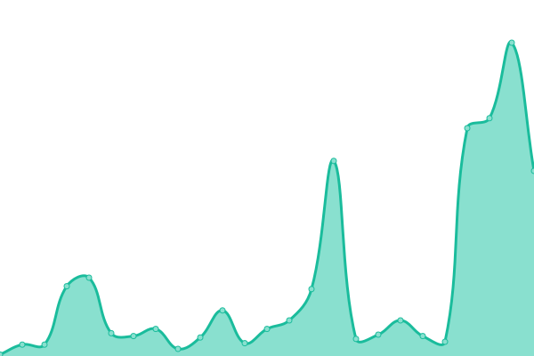

# [📈 실시간 상태](https://status.maratang.life): <!--live status--> **🟧 Partial outage**

This repository contains the open-source uptime monitor and status page for [마라탕.인생](https://maratang.life/), powered by [Upptime](https://github.com/upptime/upptime).

With [Upptime](https://upptime.js.org), you can get your own unlimited and free uptime monitor and status page, powered entirely by a GitHub repository. We use [Issues](https://github.com/MaratangLife/status/issues) as incident reports, [Actions](https://github.com/MaratangLife/status/actions) as uptime monitors, and [Pages](https://status.maratang.life) for the status page.

## [📈 Live Status](https://demo.upptime.js.org): <!--live status--> **🟧 Partial outage**

<!--start: status pages-->
<!-- This summary is generated by Upptime (https://github.com/upptime/upptime) -->
<!-- Do not edit this manually, your changes will be overwritten -->
<!-- prettier-ignore -->
| URL | Status | History | Response Time | Uptime |
| --- | ------ | ------- | ------------- | ------ |
|  [Maratang.Life Main](https://maratang.life/about) | 다운됨 | [maratang-life-main.yml](https://github.com/MaratangLife/status/commits/HEAD/history/maratang-life-main.yml) | 

 1487ms
     
 | 

<a href="https://status.maratang.life/history/maratang-life-main">84.81%</a>
    

|  [Maratang.Life API](https://maratang.life/api/v2/instance) | 다운됨 | [maratang-life-api.yml](https://github.com/MaratangLife/status/commits/HEAD/history/maratang-life-api.yml) | 

 787ms
     
 | 

<a href="https://status.maratang.life/history/maratang-life-api">84.81%</a>
    

|  [Maratang.Life Streaming](https://maratang.life/api/v1/streaming/health) | 다운됨 | [maratang-life-streaming.yml](https://github.com/MaratangLife/status/commits/HEAD/history/maratang-life-streaming.yml) | 

 332ms
     
 | 

<a href="https://status.maratang.life/history/maratang-life-streaming">84.82%</a>
    

|  [Maratang.Life User](https://maratang.life/api/v1/accounts/lookup?acct=support) | 다운됨 | [maratang-life-user.yml](https://github.com/MaratangLife/status/commits/HEAD/history/maratang-life-user.yml) | 

 481ms
     
 | 

<a href="https://status.maratang.life/history/maratang-life-user">84.82%</a>
    

|  [Maratang.Life ActivityPub](https://maratang.life/.well-known/webfinger?resource=acct:support@maratang.life) | 다운됨 | [maratang-life-activity-pub.yml](https://github.com/MaratangLife/status/commits/HEAD/history/maratang-life-activity-pub.yml) | 

 261ms
     
 | 

<a href="https://status.maratang.life/history/maratang-life-activity-pub">84.83%</a>
    

|  [Maratang.Life Storage](https://r2.maratang.life/check.txt) | 정상 | [maratang-life-storage.yml](https://github.com/MaratangLife/status/commits/HEAD/history/maratang-life-storage.yml) | 

 405ms
     
 | 

<a href="https://status.maratang.life/history/maratang-life-storage">100.00%</a>
    

<!--end: status pages-->

[**Visit our status website →**](https://status.maratang.life)

## 📄 License

- Powered by: [Upptime](https://github.com/upptime/upptime)
- Code: [MIT](./LICENSE) © [마라탕.인생](https://maratang.life/)
- Data in the `./history` directory: [Open Database License](https://opendatacommons.org/licenses/odbl/1-0/)
